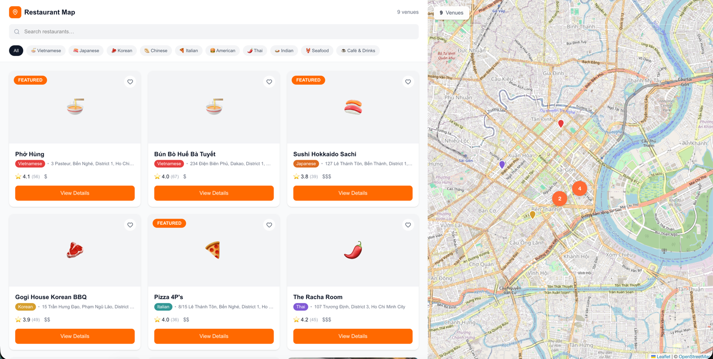
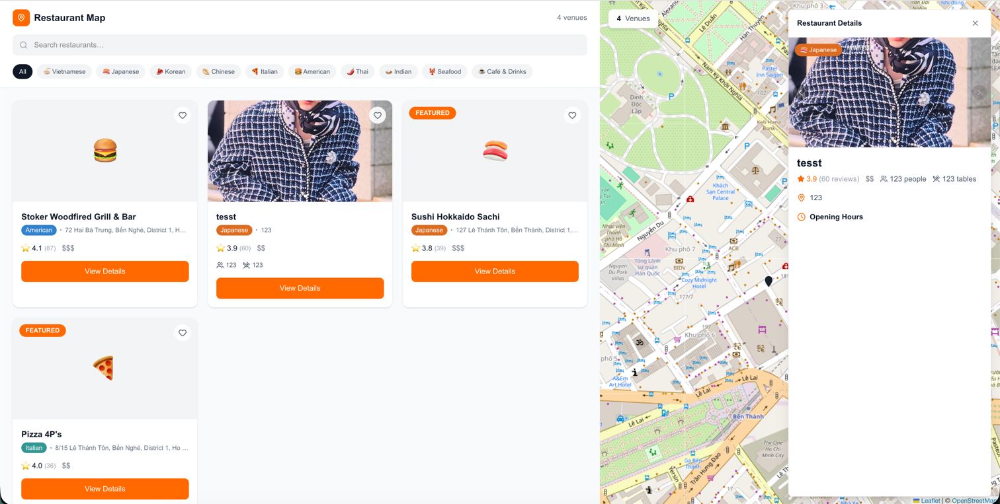
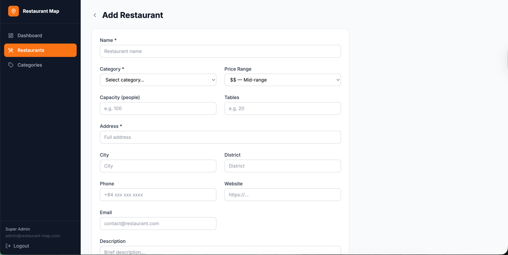
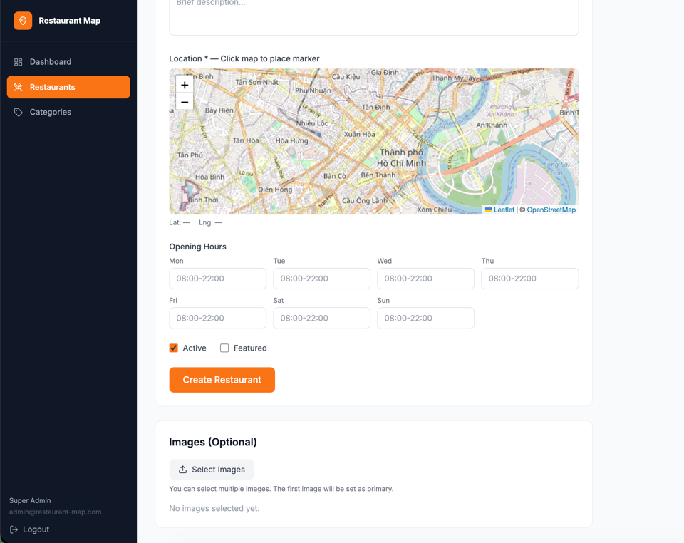

# 🍽️ Restaurant Map

A full-stack restaurant discovery platform with interactive map, clustering, ratings, and admin panel.

## 🏗️ Architecture

```
restaurant-map/
├── backend/           # Laravel 12 API
├── frontend/          # Next.js 16 (Public map view)
├── frontend-admin/    # Next.js 16 (Admin panel)
├── docker/            # Docker configurations
│   ├── nginx/         # Nginx configuration
│   ├── php/           # PHP-FPM Dockerfile & config
│   ├── frontend/      # Frontend Dockerfile
│   └── frontend-admin/# Admin Dockerfile
├── docker-compose.yml # Docker orchestration
└── .env               # Docker Compose variables
```

## 🚀 Quick Start

### Prerequisites
- Docker & Docker Compose
- Git

### Installation

1. **Clone the repository**
   ```bash
   git clone <repository-url>
   cd restaurant-map
   ```

2. **Setup environment files**
   ```bash
   # Root .env for Docker Compose
   cp .env.example .env
   
   # Backend .env for Laravel
   cp backend/.env.example backend/.env
   php artisan key:generate  # Run inside container
   ```

3. **Start Docker containers**
   ```bash
   docker-compose up -d
   ```

4. **Run migrations & seeders**
   ```bash
   docker exec restaurant_php php artisan migrate:fresh --seed
   ```

5. **Access the applications**
   - **Public Map**: http://localhost:3000
   - **Admin Panel**: http://localhost:3001
   - **API**: http://localhost:8000/api/v1

## 🔐 Default Credentials

- **Email**: `admin@restaurant-map.com`
- **Password**: `password`

## 📦 Tech Stack

### Backend
- **Framework**: Laravel 12
- **Database**: MySQL 8.0
- **Auth**: JWT (tymon/jwt-auth)
- **Storage**: Local filesystem
- **Image Processing**: Intervention Image v3.11

### Frontend (Public)
- **Framework**: Next.js 16.1.6 (Turbopack)
- **Styling**: Tailwind CSS v3.4.17
- **Map**: Leaflet + React-Leaflet
- **Clustering**: react-leaflet-cluster
- **HTTP**: Axios
- **Output**: Standalone (Docker optimized)

### Frontend (Admin)
- **Framework**: Next.js 16.1.6 (Turbopack)
- **Styling**: Tailwind CSS v3.4.17
- **Forms**: React Hook Form + Zod v3.23.8
- **State**: TanStack Query (React Query)
- **Output**: Standalone (Docker optimized)

## 🗂️ Database Schema

```
users
├── id
├── name
├── email
└── password

categories
├── id
├── name
├── slug
├── icon
└── color

restaurants
├── id
├── category_id (FK)
├── name, slug
├── description, address, city, district
├── latitude, longitude
├── phone, website, email
├── opening_hours (JSON)
├── price_range (1-4)
├── capacity (total seats)
├── tables (number of tables)
├── rating (aggregated average)
├── rating_count (total ratings)
├── is_active, is_featured
└── timestamps, soft deletes

restaurant_images
├── id
├── restaurant_id (FK → restaurants)
├── path (storage path)
├── disk (storage disk: local/s3)
├── caption (nullable)
├── is_primary (boolean)
├── sort_order (integer)
└── timestamps

ratings
├── id
├── restaurant_id (FK → restaurants)
├── user_id (FK → users, nullable)
├── user_name (for anonymous users)
├── user_email (for anonymous users)
├── rating (1-5 stars)
├── comment (text, nullable)
├── ip_address (spam prevention)
└── timestamps
```

## 🎯 Features

### Public Map
- ✅ Interactive Leaflet map with clustering
- ✅ Marker clustering (auto-groups when zoomed out)
- ✅ Category filters
- ✅ Search functionality
- ✅ Restaurant cards with:
  - Image slider (multiple photos)
  - Rating & review count (e.g., "4.5 (324)")
  - Capacity & tables info
  - Category badge with icon
- ✅ Detail panel with full restaurant info
- ✅ Rating system (authenticated & anonymous)

### Admin Panel
- ✅ JWT authentication (HTTP-only cookies)
- ✅ Restaurant CRUD operations
- ✅ Multi-image upload & management
- ✅ Category management
- ✅ Interactive map picker for coordinates
- ✅ Opening hours editor (JSON)
- ✅ Rating moderation

## 📸 Screenshots

### Frontend - Public Map View

*Interactive map with clustering, category filters, and restaurant cards with image sliders*

### Frontend - Restaurant Detail

*Detailed restaurant view with full information, image gallery, rating count, capacity, and tables*

### Admin Panel - Add Restaurant (Form)

*Admin form for creating restaurants with validation*

### Admin Panel - Add Restaurant (Map Picker)

*Interactive map picker for selecting restaurant coordinates*

## 🛠️ Development

### Backend Commands
```bash
# Run migrations
docker exec restaurant_php php artisan migrate

# Seed database
docker exec restaurant_php php artisan db:seed

# Create admin user
docker exec restaurant_php php artisan db:seed --class=AdminUserSeeder

# Generate app key
docker exec restaurant_php php artisan key:generate

# Clear cache
docker exec restaurant_php php artisan cache:clear
```

### Frontend Commands
```bash
# Rebuild frontend
docker-compose build frontend

# Rebuild admin
docker-compose build frontend-admin

# View logs
docker logs restaurant_frontend -f
docker logs restaurant_admin -f
```

## 📁 Environment Files

### Root `.env` (Docker Compose)
Used by `docker-compose.yml` for container configuration:
- MySQL credentials (DB_DATABASE, DB_USERNAME, DB_PASSWORD, DB_ROOT_PASSWORD)
- `NEXT_PUBLIC_API_URL` - passed to frontend containers
- `APP_ENV` - application environment

### `backend/.env` (Laravel)
Full Laravel configuration - copy from `backend/.env.example`:
- Database connection (uses `mysql` hostname in Docker)
- JWT secret, app key, CORS settings
- Storage, cache, queue, mail configurations

### Frontend `.env.example` (Documentation)
Both `frontend/` and `frontend-admin/` include `.env.example` files for reference.
When running via Docker Compose, environment variables are automatically injected from root `.env`.

**Note**: For local development outside Docker, create `.env.local` files in frontend directories.

## 🐛 Troubleshooting

### MySQL lock timeout
```bash
docker-compose down -v
docker-compose up -d
docker exec restaurant_php php artisan migrate:fresh --seed
```

### Images not loading (400 Bad Request)
- Check `backend/.env` has correct `APP_URL=http://localhost:8000`
- Verify `next.config.ts` has `unoptimized: true` for localhost
- Ensure `remotePatterns` includes localhost:8000

### CORS errors
- Check `backend/config/cors.php`
- Ensure `http://localhost:3000` and `http://localhost:3001` are in `allowed_origins`

### Tailwind CSS build errors
- Both frontends use Tailwind CSS v3.4.17 (NOT v4)
- Tailwind v4 has native binary issues on ARM64 Alpine
- If encountering `@tailwindcss/oxide` errors, verify `package.json` uses v3

### Frontend build fails in Docker
- Ensure `next.config.ts` has `output: 'standalone'`
- Check Dockerfile copies `.next/standalone` and `.next/static`
- Verify `package-lock.json` is committed and consistent

## 📝 License

MIT License - feel free to use for personal or commercial projects.
